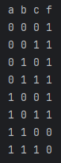
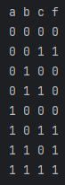
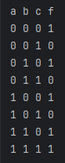

**Задача №1**
print("a b c f")
for a in [0, 1]:
    for b in [0, 1]:
        for c in [0, 1]:
            f = (not (a and b)) or (not (a or c))
            print(f"{a} {b} {c} {int(f)}")

**Задача №2**
print("a b c f")
for a in [0, 1]:
    for b in [0, 1]:
        for c in [0, 1]:
            f = (a and b) or ((not b) and c)
            print(f"{a} {b} {c} {int(f)}")

**Задача №3**
print("a b c f")
for a in [0, 1]:
    for b in [0, 1]:
        for c in [0, 1]:
            f = (a and b) or (not c)
            print(f"{a} {b} {c} {int(f)}")
            
