# План лекции: Процессор

1. Элементы процессора. Аппаратный уровень. Операционные устройства.
2. Устройство управления. Микропрограммный автомат. Микропрограмма.
3. Процессор Intel 8086. Сегментная организация памяти.
4. Команды. Кодирование команд.
5. Подпрограммы.

---

# Элементы процессора

- Дешифратор команд
- Операционные устройства (АЛУ)
- Устройство управления
- Регистры
- Транслятор адресов операндов
- Шины (внутренняя, внешняя)

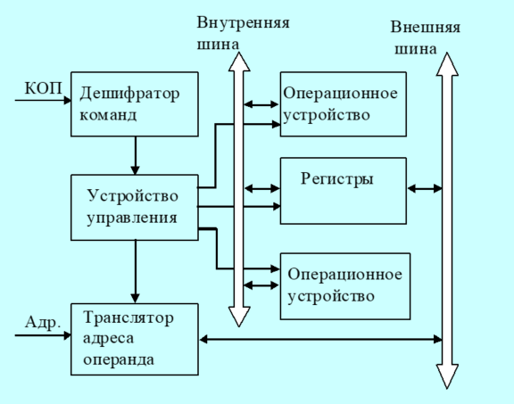

---

# Типичный микропроцессор

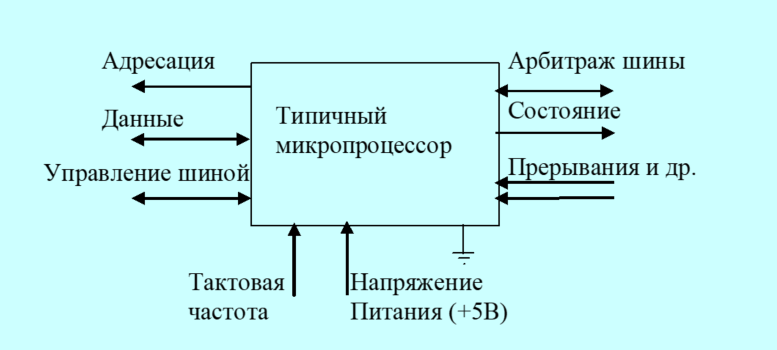

## Характеристики Intel 4004 (1971 г.)

- Вычислительная мощность: эквивалентна ENIAC
- Стоимость: 200 долларов
- Количество транзисторов: 2 300
- Размер кристалла: не больше ногтя
- Потребляемая мощность: несколько десятков ватт
- Тактовая частота: 108 кГц

---

# Операционные устройства

## Поддерживаемые операции

- целочисленная арифметика;
- логические операции;
- операции сдвига;
- десятичная арифметика;
- операции с числами с плавающей запятой;
- графические операции.

## Структурный базис

- **Регистры** — хранение слов данных.
- **Шины** — связь регистров и передача слов данных.
- **Комбинационные схемы** — реализация вычислений по управляющим сигналам от устройства управления.

---

# Регистры в операционных устройствах

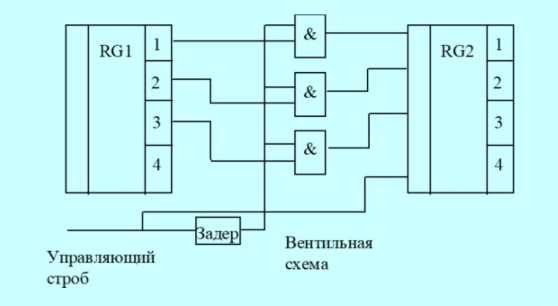

## Определение

> Регистр — линейка триггеров с входами для изменения состояния, влияющего на выходы.

## Классификация регистров

- программно‑видимые явно;
- видимые косвенно (напр., «теневые» регистры дескрипторов сегментов);
- внутренние для специальных целей (регистр адреса памяти, регистр данных для обмена с памятью);
- внутренние для хранения промежуточных результатов.

---

# Простейший мультиплексор

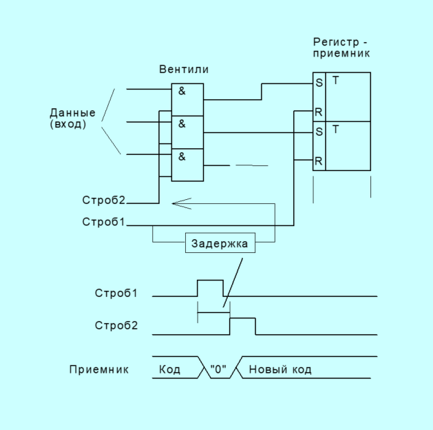

---

# Операционные устройства (АЛУ)

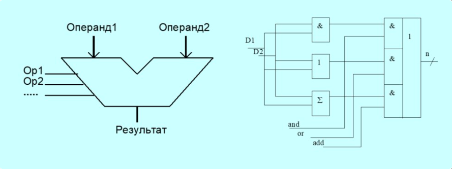

## Определение и базовая характеристика

> АЛУ (арифметико‑логическое устройство) — комбинационная схема, не содержащая внутри элементов памяти. На вход АЛУ поступают два операнда (например, содержимое двух регистров), на выходе формируется результат операции.

---

# АЛУ. Принципиальная схема

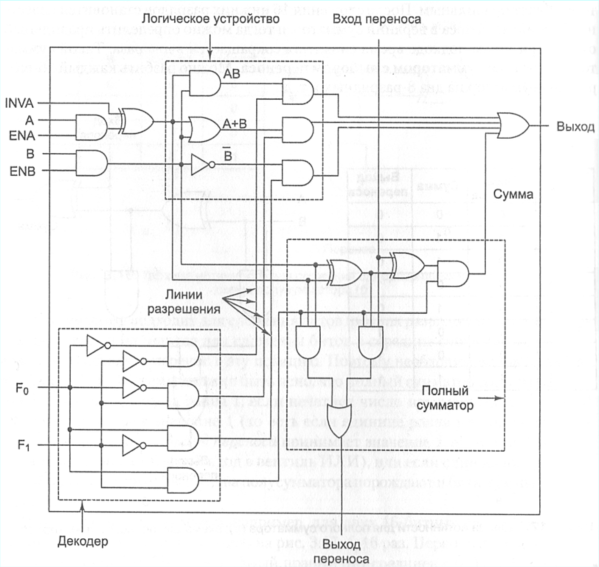

## Состав

- Логическое устройство
- Полный сумматор
- Декодер операции

---

# Восьмиразрядное АЛУ

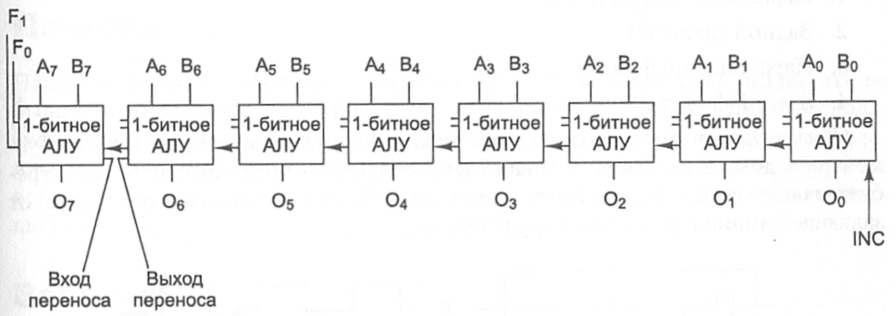

---

# Простейшие операционные устройства

## Пересылка `mov R1, R2`

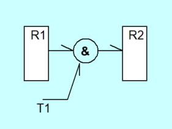

## Сдвиг `rol R0`

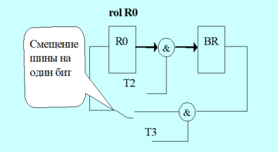

## Сложение `add R0, R`

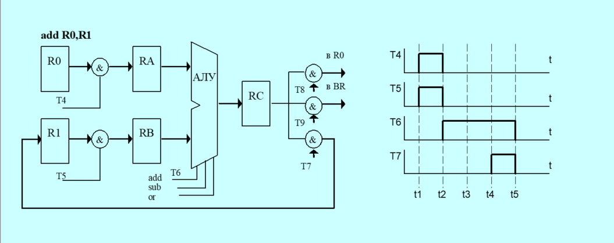

---

# Связь операционных устройств с шиной (Data Path Von Neumann)

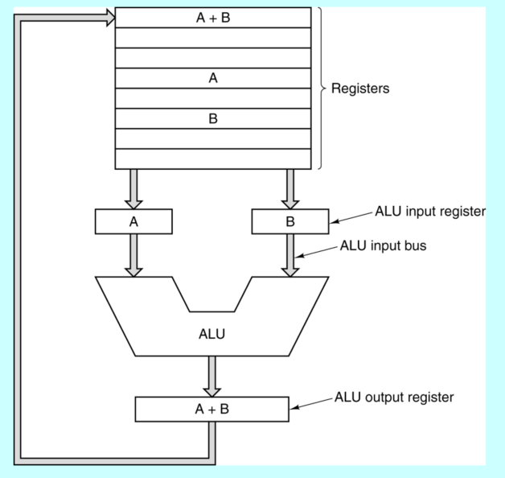

---

# Операционное устройство с магистральной структурой

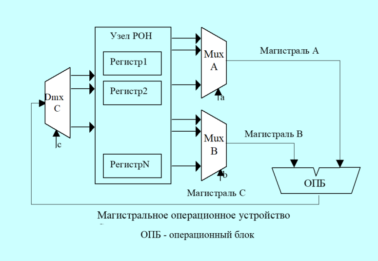

---

# Типы операционных устройств с магистральной структурой

## Трёхмагистральное ОПУ

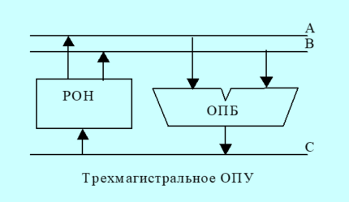

## Двухмагистральное ОПУ

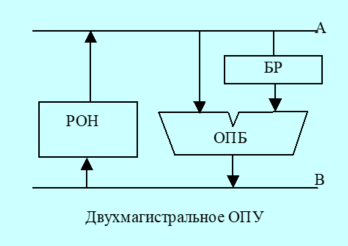

## Одномагистральное ОПУ

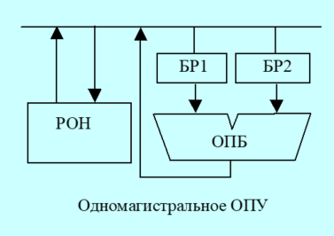

---

# Функции устройства управления ЭВМ

Устройство управления ЭВМ управляет ходом вычислительного процесса и обеспечивает автоматическое выполнение команд программы.

## Основные функции

| Функция | Описание |
| --- | --- |
| Формирование управляющих сигналов | Для выборки очередной команды из ОЗУ |
| Дешифрация кода операции | Распознавание типа выполняемой команды |
| Формирование адресов операндов | Определение местоположения данных в памяти |
| Выборка операндов из ОЗУ | Извлечение данных для обработки |
| Передача операндов в операционное устройство | Доставка данных к блоку выполнения операций |
| Выполнение операций операционным устройством | Непосредственная обработка данных |
| Передача результата в ОЗУ | Сохранение итогов вычислений |
| Инициирование операций ввода/вывода | Запуск обмена данными с внешними устройствами |
| Обработка запросов прерывания | Организация реакции процессора на внешние/внутренние события |

---

# Термины микропрограммного управления

| Термин | Определение |
| --- | --- |
| Микрооперация | Элементарные действия, выполняемые в течение одного такта сигналов синхронизации |
| Микрокоманда | Совокупность одновременно выполняемых микроопераций |
| Микропрограмма | Последовательность микрокоманд, определяющая порядок реализации машинного цикла |

---

# Состав устройства управления

## Управляющая часть УУ

*(на основе декодирования команды вырабатывает последовательность микрокоманд)*

- регистр команды;
- микропрограммный автомат (+ дешифратор команд);
- узел прерываний и приоритетов.

## Адресная часть УУ

*(обеспечивает формирование адресов команд и операндов в основной памяти)*

- операционный узел устройства управления;
- регистр адреса;
- счётчик команд.

---

# Микропрограммный автомат с жёсткой логикой

- **Выходные сигналы управления**: реализуются за счёт однажды соединённых логических схем.
- **Код операций (КОП)**: определяет сигналы управления и их последовательность формирования.
- **Сигналы управления**: привязаны к импульсам синхронизации, строго фиксированы по времени.
- **Сброс счётчика тактов**: установка в состояние $T_1$ по завершении цикла команды.
- **Цикл команды**: вариативное число тактов; каждый такт — отдельная микрокоманда (набор сигналов управления).
- **Флаги**: дополнительный фактор формирования управляющих сигналов.

## Схема микропрограммного автомата с жёсткой логикой

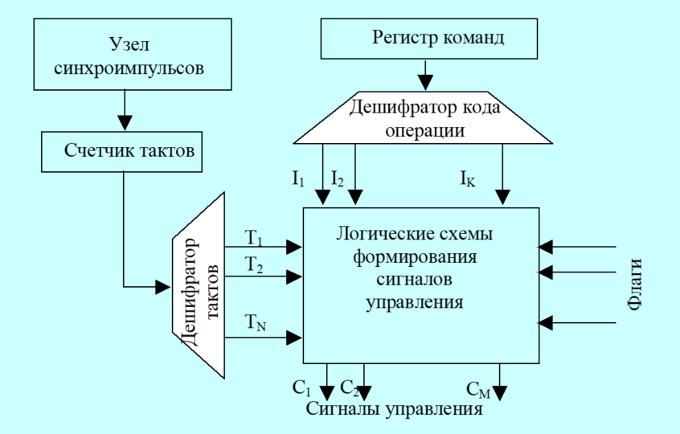

---

# Микропрограммный автомат с программируемой логикой

## Ключевые факты

- **Автор идеи**: Морис Уилкс (Кембриджский университет, 1951 г.).
- **Уровни выполнения команд**: 3 уровня (команда → микропрограмма → сигналы управления).
- **Принцип работы**: команда ЭВМ интерпретируется в микропрограмму; аппаратное обеспечение выполняет микропрограммы с ограниченным набором микрокоманд → снижение аппаратных затрат.

## Отличительные особенности

- Наличие памяти микропрограмм.
- Соответствие: 1 команда = 1 микропрограмма.

## Эволюция подхода

- **70‑е годы**: преобладание идеи предварительной интерпретации программ через микропрограммы.
- **Современные процессоры**: отказ от микропрограммирования из‑за ограничения роста производительности (аппаратные затраты менее критичны).

## Микропрограммный автомат с программируемой логикой

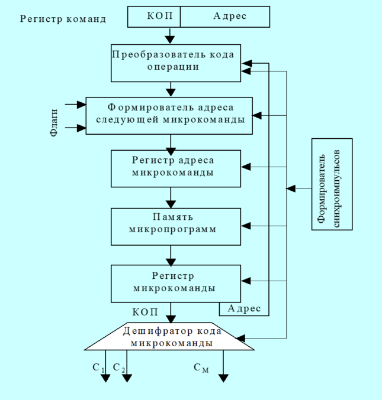

## Пример процессора с тремя шинами и его микропрограммирование

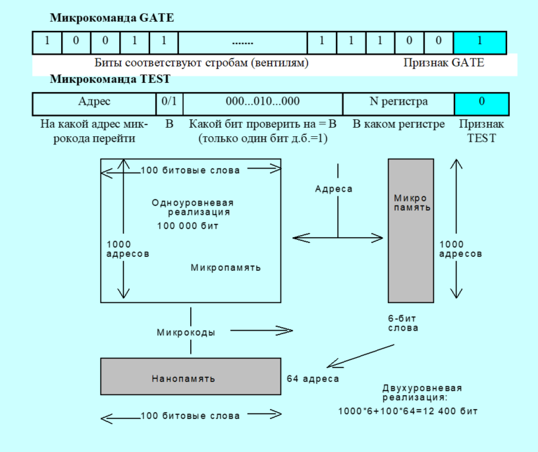

## Пример процессора с тремя шинами

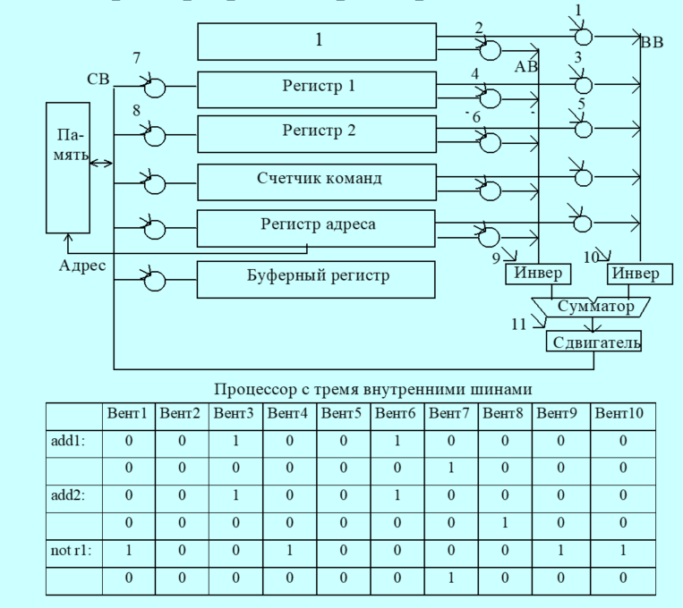

---

# Команды

Ключевой критерий выбора архитектуры системы команд — место хранения операндов и способ доступа к ним.

## Виды архитектур системы команд

- стековая;
- аккумуляторная;
- регистровая;
- с выделенным доступом к памяти.

---

# Стековая архитектура

## Определение

> **Стек** — память из взаимосвязанных ячеек, принцип работы: LIFO (Last In First Out, «последним вошёл, первым вышел»).

## Операции

- `push` — проталкивание данных в стек.
- `pop` — выталкивание данных из стека.
- Запись возможна только в верхнюю ячейку стека.

## Типы реализации

- Программный.
- Аппаратный (совокупность регистров сдвига).

## Преимущества

- Снижение издержек на адресацию.
- Идентификация всех данных через вершину стека.

---

## Стековая архитектура (схема)

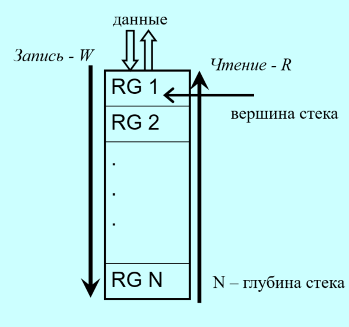

## Обратная польская запись (ОПЗ)

- Предложена Я. Лукашевичем.
- Постфиксная форма: оператор следует за операндами, скобки отсутствуют.
- Порядок операций — по приоритетам.

## Пример преобразования

- Исходное выражение: `a = a + b + a × c`
- В ОПЗ: `a = a b + a c × +`

## Характеристики стека

- Глубина стека: `N`.
- Вершина стека — точка доступа для операций.
- Операции: запись (`W`), чтение (`R`).

---

# Аккумуляторная архитектура

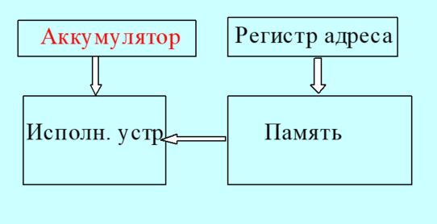

## Определение

> **Аккумулятор** — регистр для хранения результата и одного из операндов арифметической или логической операции в процессоре.

## Механизм выполнения операции

- Считывание одного операнда из памяти → регистр данных.
- Второй операнд — в аккумуляторе.
- Выходы регистра данных и аккумулятора → входы АЛУ.
- Результат с выхода АЛУ → в аккумулятор.

---

## Команды

- Загрузка в аккумулятор: `load x`.
- Сохранение из аккумулятора: `store x`.

## Достоинства и недостатки

- **Достоинства**: короткие команды, простота декодирования.
- **Недостаток**: многократные обращения к основной памяти из‑за одного регистра.

---

# Регистровая архитектура

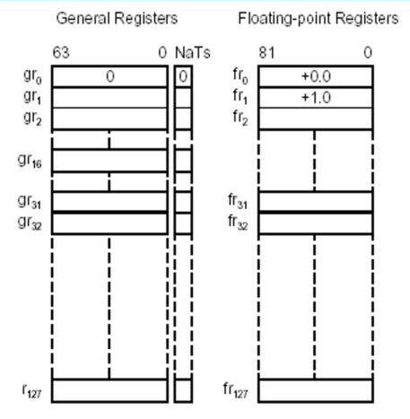

Процессор включает в себя массив регистров (регистровый файл), известных как регистры общего назначения (РОН). Эти регистры, в каком‑то смысле, можно рассматривать как явно управляемый кэш для хранения недавно использовавшихся данных.

Размер регистров обычно фиксирован и совпадает с размером машинного слова. К любому регистру можно обратиться, указав его номер.

## Количество РОН

- **CISC**: небольшое число РОН.
- **RISC**: существенно большее число РОН (до нескольких сотен).

## Расположение операндов

- Основная память.
- Регистры.

## Подвиды команд обработки

- Регистр‑регистр.
- Регистр‑память.
- Память‑память.

## Достоинства и недостатки

- **Достоинства**: компактность кода, высокая скорость вычислений (замена обращений к памяти на обращения к регистрам).
- **Недостаток**: более длинные инструкции по сравнению с аккумуляторной архитектурой.

---

# Архитектура с выделенным доступом к памяти

## Основные принципы

- Обращение к основной памяти — только через команды `load` и `store`.
- `load`: чтение из ячейки памяти в регистр.
- `store`: запись из регистра в память.

## Особенности обработки данных

- Операнды команд обработки — исключительно в регистрах общего назначения.
- Результат операции — только в регистре.
- Отсутствие команд обработки с прямым обращением к памяти.

## Характеристики и примеры

- Типична для RISC‑архитектур.
- Длина команды: 32 бита.
- Формат: трёхадресный.
- Примеры процессоров: Sun SPARC, MIPS R10000, DEC Alpha, PowerPC.

## Схема

---

# Конфигурируемые процессоры Xtensa (Tensilica)

## Назначение Xenergy

- Инструмент САПР для оценки влияния конфигураций процессора на суммарное энергопотребление.
- Фокус на энергоэффективности подсистемы «процессор–память» (в отличие от традиционных инструментов, ориентированных на производительность и размер кода).

## Поддерживаемые платформы

- Процессоры Xtensa.
- Процессоры Diamond Standard (Tensilica).

## Функциональные возможности

- Моделирование выполнения прикладных программ на ядрах с разными конфигурациями.
- Оценка рассеиваемой мощности: процессор, кэш‑память, локальная память, связанная с ядром.

## Возможности модификации конфигурации

- Добавление расширений команд.
- Включение дополнительных регистровых файлов.
- Интеграция специализированных программных модулей.

## Цели оптимизации

- Снижение общей мощности, потребляемой процессором и памятью.
- Балансировка площади кристалла, производительности и энергопотребления на ранних этапах проектирования.

---

# Процессор Intel 8086

## Структурная схема

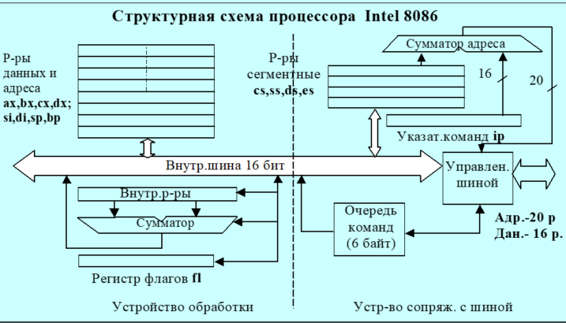

---

# Регистр флагов процессора 8086

## Структура регистра (биты 0–15)

| Бит | Флаг | Описание |
|-----|------|----------|
| 0   | CF   | Carry Flag — флаг переноса |
| 1   | —    | Зарезервирован (всегда 0) |
| 2   | PF   | Parity Flag — флаг чётности |
| 3   | —    | Зарезервирован (всегда 0) |
| 4   | AF   | Auxiliary Carry Flag — флаг вспомогательного переноса |
| 5   | —    | Зарезервирован (всегда 0) |
| 6   | ZF   | Zero Flag — флаг нуля |
| 7   | SF   | Sign Flag — флаг знака |
| 8   | TF   | Trap Flag — флаг прерывания для отладки |
| 9   | IF   | Interrupt-Enable Flag — флаг разрешения прерывания |
| 10  | DF   | Direction Flag — флаг направления цепочечных команд |
| 11  | OF   | Overflow Flag — флаг переполнения |
| 12–15 | —  | Зарезервированы |

## Примечания

- Флаги автоматически обновляются после арифметических/логических операций.
